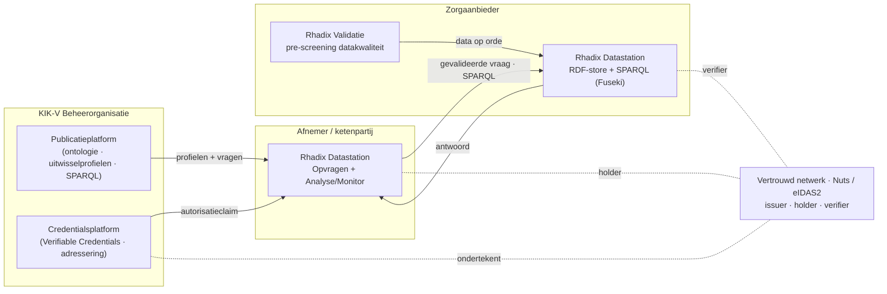

# Rhadix — Architectuur & positionering binnen KIK-V

> Dit document plaatst de Rhadix-applicaties binnen het officiële KIK-V
> applicatielandschap (Architectuur Explainer, juni 2024) en de functionele eisen
> aan een datastation (Project Phoenix, augustus 2025). Het legt vast wat we
> bouwen, hoe het mapt op de KIK-V-rollen, en welke lagen we (nog) simuleren.

## 1. Het uitgangspunt: een federatief datastelsel

KIK-V (Keten Informatie Kwaliteit Verpleeghuiszorg) is geen centrale database maar
een **federatief stelsel**, gebouwd op de DIZRA-principes. De kern:

- **Data blijft bij de bron.** De zorgaanbieder houdt regie over welke gegevens
  worden gedeeld, met wie en wanneer.
- **Alleen de vraag reist.** Een afnemer stelt een *gevalideerde vraag* (een
  vastgestelde SPARQL-query), die lokaal bij de aanbieder wordt uitgerekend.
- **Eén gemeenschappelijke taal.** Brongegevens én vragen worden uitgedrukt in de
  modelgegevensset — een OWL-ontologie — zodat antwoorden eenduidig en vergelijkbaar zijn.
- **Vertrouwd door techniek.** Een vraag is pas "gevalideerd" als hij door de
  beheerorganisatie cryptografisch is ondertekend (W3C Verifiable Credentials,
  eIDAS2/Nuts) en de aanbieder dat kan verifiëren.

Rhadix is in essentie een **digital twin** van dit stelsel: dezelfde rollen,
dezelfde flow, met de echte trust-laag (voorlopig) gesimuleerd.

## 2. De officiële KIK-V-rollen

| Rol | Officieel component | Functie |
|-----|---------------------|---------|
| Beheerorganisatie | **Publicatieplatform** | Publiceert afsprakenset, ontologie, uitwisselprofielen en gevalideerde SPARQL-vragen |
| Beheerorganisatie | **Credentialsplatform** | Geeft autorisatieclaims (Verifiable Credentials) uit en trekt ze in; levert ook adressering (datastation vinden via gevalideerd KvK) |
| Afnemer (NZa, IGJ, VWS, Zorgkantoren) | **Rhadix Datastation** | Gevalideerde vragen stellen aan aanbieders én analyses uitvoeren op de antwoorden (multi-tenant, *tijdelijke* oplossing) |
| Aanbieder (zorgaanbieder) | **Datastation** | Data beschikbaar stellen en gevalideerde vragen beantwoorden (RDF-store + SPARQL) |
| Netwerk | **Vertrouwd netwerk (Nuts)** | Publiceert sleutels; maakt issuer/holder/verifier-vertrouwen mogelijk |

## 3. Hoe de Rhadix-apps hierop mappen

| Rhadix-app | Officiële rol | Mapping | Status |
|------------|---------------|---------|--------|
| **Rhadix Validatie** | (aanbieder, datakwaliteit) | Pre-screening: is mijn datahuishouding klaar om gevalideerde vragen te beantwoorden? Toevoeging op het model, geen 1‑op‑1. | In gebruik |
| **Rhadix Datastation** | Datastation | 1‑op‑1. Fuseki = de motor (functie 3+4: SPARQL + data beschikbaar stellen). De volledige spec heeft een compliance-schil eromheen (zie §5). | Kern (Fuseki) |
| **Rhadix Datastation** | Rhadix Datastation (afnemer) | 1‑op‑1, opvolger van de tijdelijke Rhadix Datastation. Modules: **Opvragen** (de vraag-wizard) en **Analyse/Monitor** (dashboards). | In aanbouw |

## 4. Naamgeving — waarom "Rhadix Datastation"

De officiële afnemer-rol is letterlijk *"gevalideerde vragen stellen én analyses
uitvoeren op de antwoorden."* De dashboarding (aantal gestelde/beantwoorde vragen,
doorlooptijd) is dus de **analyse-helft** van diezelfde rol — geen nieuwe functie.
"Uitvraag" met een **Analyse/Monitor**-module dekt de rol volledig.

We gebruiken bewust **niet** "Regie": in KIK-V is dat woord al bezet voor (a) de
regie die de *aanbieder* houdt over zijn data en (b) de governance-laag
(regievoering, NEN‑7522). "Uitvraag" is bovendien de term die de doelgroep kent.

Voorgestelde familie:

- **Rhadix Validatie** — kwaliteit aan de bron (pre-screening).
- **Rhadix Datastation** — rekenkracht aan de bron (het federatieve knooppunt).
- **Rhadix Datastation** — vraag & analyse aan de afnemerskant.

## 5. Wat we (nog) simuleren — de weg naar een complete twin

Drie lagen zijn in de huidige twin vereenvoudigd of gesimuleerd. Ze horen op de
plaat, want hier zit het verschil tussen "demo" en "twin van het stelsel".

1. **Vertrouwd netwerk + credentials (grootste gap).** In het echte stelsel
   ondertekent KIK-V Beheer de gevalideerde vraag als W3C *Verifiable Credential*
   (issuer); de afnemer is *holder*; het datastation is *verifier* en weigert
   vragen zonder geldige, vertrouwde claim. Nu gesimuleerd. Toekomstige laag:
   bv. *Rhadix Vertrouwen* of integratie met Nuts.
2. **Publicatieplatform.** Bron van ontologie, uitwisselprofielen en gevalideerde
   SPARQL-queries. Rhadix Datastation haalt profielen nu uit een ingebouwde/instelbare
   bron (`RHADIX_PROFILES_URL`); een echt publicatieplatform/catalogus completeert dit.
3. **Adressering.** Een datastation vinden via een gevalideerd KvK-nummer uit het
   Landelijk Zorgaanbiedersregister. De zelfregistratie van zorgaanbieders in
   Rhadix Datastation is daar de pragmatische twin-variant van.

### Datastation — compliance-schil rond Fuseki

De KIK-V-eisen aan een datastation gaan verder dan SPARQL uitvoeren. Voor een
"echt" datastation horen ook: afnemer identificeren/authenticeren, versleuteld
kanaal, uitwisselprofiel-metadata ophalen, de "verklaring overeenkomst
uitwisselprofiel" verifiëren (geldigheid + vertrouwde uitgever), controleren dat
de vraag tot de gevalideerde vragen behoort, parameters valideren, routeren naar
de juiste named-graph, **handmatige antwoordcontrole met registratie**, adres van
de afnemer vinden, en een **audittrail met zaaknummer** van ontvangst tot
verzending. Fuseki levert de rekenkern; deze schil maakt het compliant.

## 6. Standaarden en kaders

RDF · SPARQL 1.1 · OWL2 · semantic reasoning · SKOS (relaties met ZIB's) ·
FAIR-principes · DIZRA · NEN 7510 (informatiebeveiliging) · NEN 7522 (governance) ·
W3C Verifiable Credentials · Nuts / eIDAS2 (vertrouwensinfrastructuur) ·
HealthDCAT (datacatalogus, toekomstig).

## 7. Samengevat

De opzet klopt en is een nette federatieve twin: **Datastation** is 1‑op‑1,
**Uitvraag** is de opvolger van de Rhadix Datastation (met analyse/monitor als logische
uitbreiding), en **Validatie** is een zinvolle pre-screening-toevoeging. De
belangrijkste volgende stap richting volledigheid is het modelleren van de
**vertrouwenslaag** (Verifiable Credentials / Nuts).
